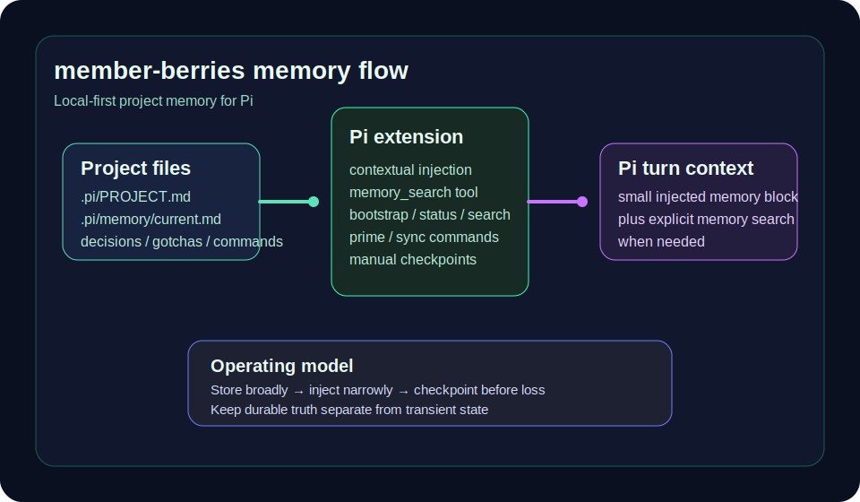

<div align="center">

# member-berries

**Local-first project memory for Pi**

[](LICENSE)
[](package.json)
[](package.json)
[](https://github.com/cheesejaguar/member-berries/releases/tag/v1.0.0)

Human-readable memory for Pi projects:

**project identity · current state · decisions · gotchas · commands · checkpoints**



</div>

---

## Overview

`member-berries` gives Pi a disciplined, repo-local memory layer.

Instead of relying on opaque long-term memory, it keeps important project context in files that live alongside the codebase:
- what the project is
- what is happening now
- why important decisions were made
- which failures are likely to recur
- which commands are actually trusted
- what changed recently

The result is a memory system that is:
- **local-first**
- **inspectable**
- **editable by humans**
- **small enough to stay useful**

## Why it exists

Most agent memory approaches fail in one of two ways:

1. **No memory** — every session starts cold.
2. **Too much memory** — the model gets flooded with stale or low-value context.

`member-berries` takes a middle path:
- store broadly
- inject narrowly
- retrieve on demand
- checkpoint before context loss
- separate durable truth from transient work state

## What you get in v1.0.0

### Memory model
Each project gets a local `.pi/` memory layout:

```text
.pi/
  PROJECT.md
  memory/
    current.md
    decisions.md
    gotchas.md
    commands.md
    checkpoints/
```

Each file has one job:
- `PROJECT.md` — stable project identity
- `current.md` — live working memory
- `decisions.md` — durable rationale
- `gotchas.md` — recurring traps and fixes
- `commands.md` — trusted repo operations
- `checkpoints/` — short time-indexed work snapshots

### Pi extension
The package includes a Pi extension with:
- contextual prompt-start memory injection
- lifecycle checkpoints on pre-compact and shutdown
- local memory search
- guided durable-memory promotion
- checkpoint pruning / duplicate cleanup

### Commands
- `/memory-bootstrap`
- `/memory-status`
- `/memory-search <query>`
- `/memory-prime [prompt]`
- `/memory-sync`
- `/memory-prune [keepCount]`
- `/memory-promote`

### Tools
- `memory_search`
- `memory_promote`

### Supporting material
- reusable templates
- onboarding docs
- sample project
- tested helper core

## Install

### Install from local path

```bash
pi install /Users/aaron/Documents/member-berries
```

### Install from GitHub

```bash
pi install git:github.com/cheesejaguar/member-berries
```

## Quick start

1. Install the package.
2. Open Pi inside a project.
3. Run:

```text
/memory-bootstrap
```

4. Fill in:
- `.pi/PROJECT.md`
- `.pi/memory/current.md`

5. Use the memory commands as needed:
- `/memory-status`
- `/memory-search <query>`
- `/memory-prime [prompt]`
- `/memory-sync`
- `/memory-promote`

For a fuller walkthrough, see [docs/quickstart.md](docs/quickstart.md).

## Example workflow

A practical daily loop looks like this:

1. keep `.pi/PROJECT.md` accurate
2. keep `.pi/memory/current.md` current
3. record only real, future-relevant decisions
4. add gotchas only when they are costly or likely to recur
5. checkpoint before stopping or switching context
6. use memory search when deeper context is needed

## Demo

See:
- [docs/demo-workflow.md](docs/demo-workflow.md)
- [examples/sample-project/README.md](examples/sample-project/README.md)

The sample project shows a realistic `.pi/` memory setup and the intended writing style for each file.

## How it works

On each prompt, the extension tries to give Pi the smallest useful amount of memory:
- always-on project identity from `PROJECT.md`
- always-on live state from `current.md`
- selectively retrieved snippets from decisions, gotchas, commands, and checkpoints

This keeps context small while still making past reasoning and operational knowledge available.

For the full model, see [docs/how-it-works.md](docs/how-it-works.md).

## Safety and privacy

`member-berries` is designed to be **local-first**.

Current guarantees:
- no cloud memory service
- no hidden sync
- no vector database dependency
- human-readable repo-local files

Durable memory writes are intended to be conservative:
- decisions should be explicit
- gotchas should be proven and likely to recur
- commands should be verified

## Repository structure

```text
member-berries/
  docs/        # onboarding and conceptual docs
  examples/    # realistic sample project
  extension/   # Pi extension and helper core
  specs/       # design and implementation plans
  templates/   # reusable .pi memory templates
  tests/       # helper tests
```

## Documentation

- [Quick start](docs/quickstart.md)
- [How it works](docs/how-it-works.md)
- [Demo workflow](docs/demo-workflow.md)
- [Releasing](docs/releasing.md)
- [Repository guide](docs/repository-guide.md)
- [Extension details](extension/README.md)
- [Design spec](specs/2026-04-10-pi-project-memory-design.md)

## Release status

This is the **v1.0.0** release of the project.

That means it is intended to be usable, installable, and understandable today — while still leaving room for future improvements in ranking, pruning, approval flows, and broader eval coverage.

## License

MIT
